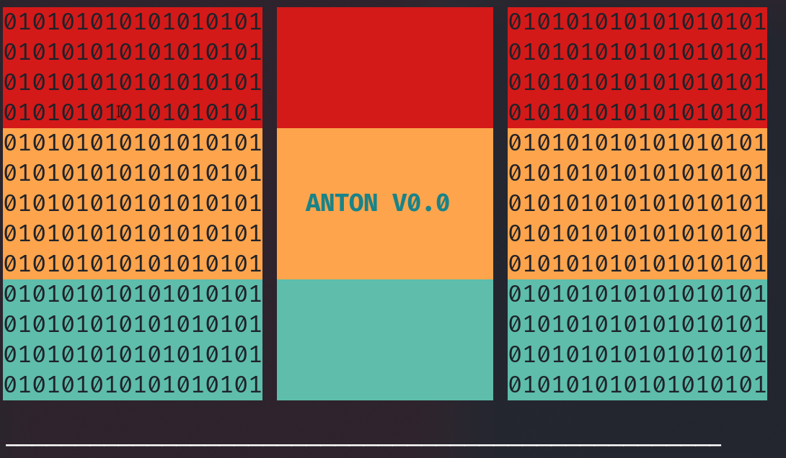
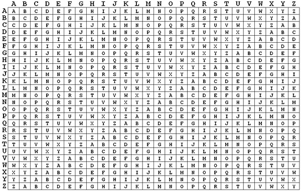

# py_anton

A python tool that has functions to Encrypt and Decrypt Vegener Cypher, and also generate QR Codes

A python tool

Tools embeded

### 1 Making Qr Codes

### 2 Encrypting and Decrypting with Vegener Cypher

